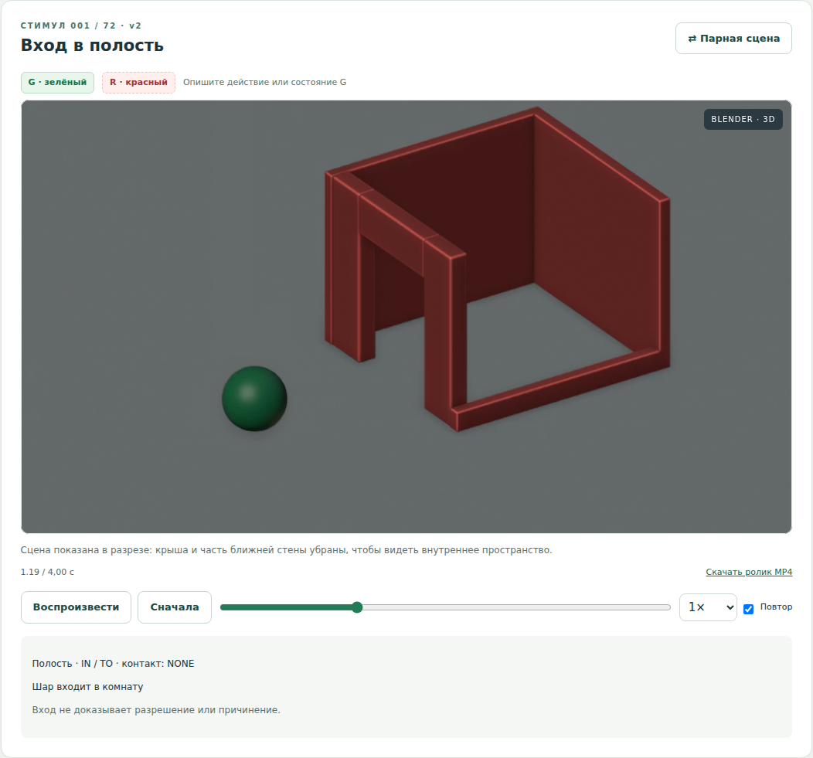
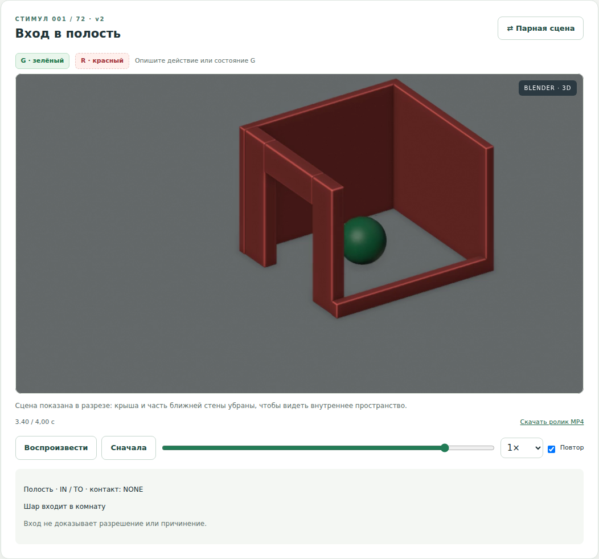
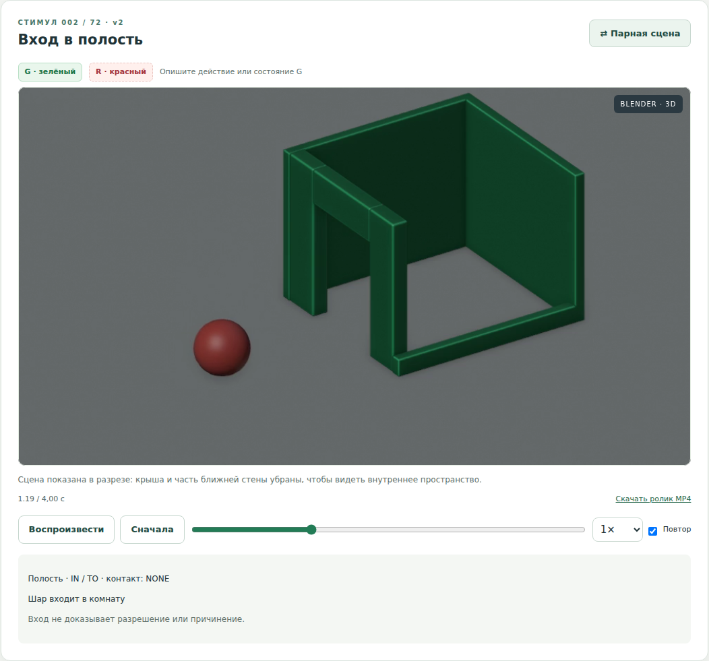

# Проверенный 3D-комплект — 7 октября 2026

## Опубликованные исходники

72 редактируемые Blender-сцены и ресурсы добавлены GitHub Actions коммитом
`39eec293ef9b4c38af7ca04a0be7739cb8cbc968`.

- Модели: `models/blender/v2/*.blend`.
- Геометрия и траектории: `tools/scene3d.py`.
- Построение, ключевые кадры и рендер: `tools/render3d.py`.
- MP4 и контрольные кадры: `src/main/resources/static/media/v2/`.
- Проверка ресурсов: `models/blender/v2/verification.json`.

Рендер: https://github.com/Eljah/cezmec/actions/runs/37614171607

## Интеграция в Java-приложение

GitHub Actions применил обновление, собрал JAR, выполнил тесты с реальным
Spring Boot-сервером и закоммитил прошедший проверку код и снимки браузера:
`15cc40a8147b1d254d584797d4ff80d7ce1ef44b`.

Успешный запуск: https://github.com/Eljah/cezmec/actions/runs/37619070529

Результаты из артефакта этого запуска:

- JUnit: 17 тестов, 0 ошибок, 0 падений, 0 пропусков.
- Playwright / Microsoft Edge: 9 тестов, 9 успешных, 0 нестабильных, 0 пропусков.
- Среди них проверены реально декодированные кадры, движение, пауза, шкала времени,
  скорость, смена цветовых ролей, сохранение татарских формулировок и все 72 ролика.
- Получены 72 отдельных браузерных снимка области видео, по одному на стимул.
- Валидатор 3D: 10 836 состояний геометрии; 72 пары файлов модель/видео проверены
  по SHA-256, ролики полностью декодированы FFmpeg; 960 × 540, 24 кадра/с, 96 кадров.
- 44 теста прежней SVG-геометрии сохранены для проверки исторической версии 1.
  Они не используются как доказательство корректности новых 3D-моделей.

## Настоящие снимки работающего сайта

Эти PNG сняты браузерными тестами. Это не изображения, нарисованные генератором,
и не монтаж рендера поверх старого интерфейса.

Полная страница: [desktop](screenshots/cezmec-3d-desktop.png).
Мобильная область сцены: [mobile](screenshots/cezmec-3d-mobile.png).

В этой версии на сайте проигрывается предварительно отрендеренное видео;
интерактивного вращения камеры нет. Нативные `.blend` позволяют редактировать
геометрию, движения, материалы и камеру с последующим повторным рендером.
Исходная ветка: `feature/spatial-crowdsource-20261007`, PR #1. Публикация кода
не означает развёртывание публичного сервера. `main` автоматически не изменялся.
